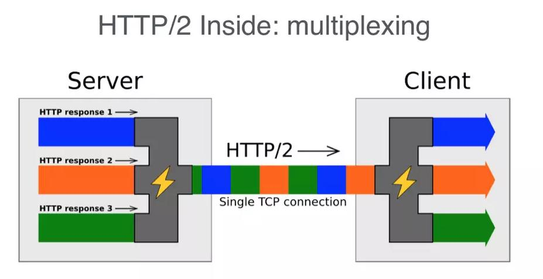

# Http

# http, https/2, https

### 问题：简单讲解一下 http2 的多路复用

HTTP2采用二进制格式传输，取代了HTTP1.x的文本格式，二进制格式解析更高效。
多路复用代替了HTTP1.x的序列和阻塞机制，所有的相同域名请求都通过同一个TCP连接并发完成。在HTTP1.x中，并发多个请求需要多个TCP连接，浏览器为了控制资源会有6-8个TCP连接都限制。
HTTP2中

- 同域名下所有通信都在单个连接上完成，消除了因多个 TCP 连接而带来的延时和内存消耗。
- 单个连接上可以并行交错的请求和响应，之间互不干扰

## http

HTTP（超文本传输协议）是一种可扩展的协议，无状态的。它是应用层的协议，通过[TCP](https://developer.mozilla.org/en-US/docs/Glossary/TCP)，或者是`TLS`加密的TCP连接来发送，理论上任何可靠的传输协议都可以使用。

**无状态**

在同一个连接中，两个执行成功的请求之间是没有关系的。这就带来了一个问题，用户没有办法在同一个网站中进行连续的交互，比如在一个电商网站里，用户把某个商品加入到购物车，切换一个页面后再次添加了商品，这两次添加商品的请求之间没有关联，浏览器无法知道用户最终选择了哪些商品。而使用HTTP的头部扩展，HTTP Cookies就可以解决这个问题。把Cookies添加到头部中，创建一个会话让每次请求都能共享相同的上下文信息，达成相同的状态。

>  注意，HTTP本质是无状态的，使用Cookies可以创建有状态的会话。

### http报文

**请求（Request）**

请求由以下元素组成：

- 请求行（http method，资源地址，http协议版本号）
- 请求头（http headers）
- 请求体（发送的资源body）


**响应**

响应报文包含了下面的元素：

- 状态行（http协议版本号，状态码，状态信息）
- 响应头（http headers）
- 响应体（获取的资源body）


### 请求方法

截止到HTTP1.1共有下面几种方法：

| 方法    | 描述                                                         |
| :------ | :----------------------------------------------------------- |
| GET     | GET方法请求一个指定资源的表示形式. 使用GET的请求应该只被用于获取数据. |
| POST    | POST方法用于将实体提交到指定的资源，通常导致在服务器上的状态变化或副作用. |
| PUT     | PUT请求会身向指定资源位置上传其最新内容，PUT方法是幂等的方法。通过该方法客户端可以将指定资源的最新数据传送给服务器取代指定的资源的内容。 |
| PATCH   | PATCH方法用于对资源应用部分修改                              |
| DELETE  | DELETE请求用于请求服务器删除所请求URI所标识的资源。DELETE请求后指定资源会被删除. |
| OPTIONS | 允许客户端查看服务器的性能。                                 |
| CONNECT | HTTP/1.1协议中预留给能够将连接改为管道方式的代理服务器。     |
| HEAD    | 类似于get请求，只不过返回的响应中没有具体的内容，用于获取报头 |
| TRACE   | 回显服务器收到的请求，主要用于测试或诊断。                   |

### http状态码，缓存

[见https://github.com/moshang-xc/Blog/issues/7](https://github.com/moshang-xc/Blog/issues/7)

### 常见首部

- **通用首部字段（请求报文与响应报文都会使用的首部字段）**
  - Date：创建报文时间
  - Connection：连接的管理
  - Cache-Control：缓存的控制
  - Transfer-Encoding：报文主体的传输编码方式
- **请求首部字段（请求报文会使用的首部字段）**
  - Host：请求资源所在服务器
  - Accept：可处理的媒体类型
  - Accept-Charset：可接收的字符集
  - Accept-Encoding：可接受的内容编码
  - Accept-Language：可接受的自然语言
- **响应首部字段（响应报文会使用的首部字段）**
  - Accept-Ranges：可接受的字节范围
  - Location：令客户端重新定向到的URI
  - Server：HTTP服务器的安装信息
- **实体首部字段（请求报文与响应报文的的实体部分使用的首部字段）**
  - Allow：资源可支持的HTTP方法
  - Content-Type：实体主类的类型
  - Content-Encoding：实体主体适用的编码方式
  - Content-Language：实体主体的自然语言
  - Content-Length：实体主体的的字节数
  - Content-Range：实体主体的位置范围，一般用于发出部分请求时使用

### http历史

#### http0.9

HTTP 的最早版本诞生在 1991 年，这个最早版本和现在比起来极其简单，没有 HTTP 头，没有状态码，甚至版本号也没有，后来它的版本号才被定为 0.9 来和其他版本的 HTTP 区分。HTTP/0.9 只支持一种方法—— Get，请求只有一行。

```
GET /hello.html
```

响应也是非常简单的，只包含 html 文档本身。

```
<HTML>
Hello world
</HTML>
```

当 TCP 建立连接之后，服务器向客户端返回 HTML 格式的字符串。发送完毕后，就关闭 TCP 连接。由于没有状态码和错误代码，如果服务器处理的时候发生错误，只会传回一个特殊的包含问题描述信息的 HTML 文件。这就是最早的 HTTP/0.9 版本。

#### http1.0

相比 HTTP/0.9，HTTP/1.0 主要有如下特性：

- 请求与响应支持 HTTP 头，增加了状态码，响应对象的一开始是一个响应状态行
- 协议版本信息需要随着请求一起发送，支持 HEAD，POST 方法
- 支持传输 HTML 文件以外其他类型的内容

一个典型的 HTTP/1.0 的请求像这样：

```php+HTML
GET /hello.html HTTP/1.0
User-Agent:NCSA_Mosaic/2.0(Windows3.1)

200 OK
Date: Tue, 15 Nov 1996 08:12:31 GMT
Server: CERN/3.0 libwww/2.17
Content-Type: text/html

<HTML>
一个包含图片的页面
<IMGSRC="/smile.gif">
</HTML>
```

#### http1.1

HTTP/1.1 更多的是作为对 HTTP/1.0 的完善，在 HTTP1.1 中，主要具有如下改进：

- **HTTP 1.1支持长连接（PersistentConnection）**

HTTP 1.0规定浏览器与服务器只保持短暂的连接，浏览器的每次请求都需要与服务器建立一个TCP连接，服务器完成请求处理后立即断开TCP连接，服务器不跟踪每个客户也不记录过去的请求。
	HTTP 1.1则支持持久连接Persistent Connection, 并且默认使用persistent  connection. 在同一个tcp的连接中可以传送多个HTTP请求和响应. 多个请求和响应可以重叠，多个请求和响应可以同时进行. HTTP 1.1的持续连接，也需要增加新的请求头来帮助实现，例如，Connection请求头的值为**Keep-Alive**时，客户端通知服务器返回本次请求结果后保持连接；Connection请求头的值为close时，客户端通知服务器返回本次请求结果后关闭连接。

- **请求的流水线（Pipelining）处理**

请求的流水线（Pipelining）处理，在一个TCP连接上可以传送多个HTTP请求和响应，减少了建立和关闭连接的消耗和延迟。例如：一个包含有许多图像的网页文件的多个请求和应答可以在一个连接中传输，但每个单独的网页文件的请求和应答仍然需要使用各自的连接。  HTTP 1.1还允许客户端不用等待上一次请求结果返回，就可以发出下一次请求，但服务器端必须按照接收到客户端请求的先后顺序依次回送响应结果，以保证客户端能够区分出每次请求的响应内容。

> 注意：这个pipelining仅仅是限于理论场景下，大部分桌面浏览器仍然会选择默认关闭HTTP pipelining！所以现在使用HTTP1.1协议的应用，都是有可能会开多个TCP连接的！

- **HTTP 1.1增加host字段**

在HTTP1.0中认为每台服务器都绑定一个唯一的IP地址，因此，请求消息中的URL并没有传递主机名（hostname）。但随着虚拟主机技术的发展，在一台物理服务器上可以存在多个虚拟主机（Multi-homed Web Servers），并且它们共享一个IP地址。

HTTP1.1的请求消息和响应消息都应支持Host头域，且请求消息中如果没有Host头域会报告一个错误（400 Bad Request）。此外，服务器应该接受以绝对路径标记的资源请求。

- **错误通知的管理**

在HTTP1.1中新增了24个错误状态响应码，如409（Conflict）表示请求的资源与资源的当前状态发生冲突；410（Gone）表示服务器上的某个资源被永久性的删除。

HTTP/1.1加入了一个新的状态码100（Continue）。客户端事先发送一个只带头域的请求，如果服务器因为权限拒绝了请求，就回送响应码401（Unauthorized）；如果服务器接收此请求就回送响应码100，客户端就可以继续发送带实体的完整请求了。100 (Continue) 状态代码的使用，允许客户端在发request消息body之前先用request header试探一下server，看server要不要接收request body，再决定要不要发request body。

- **带宽优化及网络连接的使用**

HTTP/1.1中引入了Chunked transfer-coding来解决上面这个问题，发送方将消息分割成若干个任意大小的数据块，每个数据块在发送时都会附上块的长度，最后用一个零长度的块作为消息结束的标志。这种方法允许发送方只缓冲消息的一个片段，避免缓冲整个消息带来的过载。

- **缓存处理**

HTTP/1.1在1.0的基础上加入了一些cache的新特性，当缓存对象的Age超过Expire时变为stale对象，cache不需要直接抛弃stale对象，而是与源服务器进行重新激活（revalidation）。

- 新增了 OPTIONS,PUT, DELETE, TRACE, CONNECT 方法

### http2

HTTP 1.1提出了管线化(pipelining)理论，但是仅仅是限于理论的阶段上，这个功能默认还是关闭了的。

管线化(pipelining)和非管线化的**区别**：

- HTTP Pipelining其实是把多个HTTP请求放到一个TCP连接中一一发送，而在发送过程中不需要等待服务器对前一个请求的响应；只不过，**客户端还是要按照发送请求的顺序来接收响应！**

就像在超市收银台或者银行柜台排队时一样，你并不知道前面的**顾客**是干脆利索的还是会跟收银员/柜员磨蹭到世界末日（不管怎么说，服务器（即收银员/柜员）是要按照顺序处理请求的，如果**前一个请求非常耗时（顾客磨蹭）**，那么后续请求都会受到影响。

- 在HTTP1.0中，发送一次请求时，需要**等待服务端响应了**才可以继续发送请求。
- 在HTTP1.1中，发送一次请求时，不需要等待服务端响应了就可以发送请求了，但是回送数据给客户端的时候，客户端还是需要按照**响应的顺序**来一一接收

所以说，无论是HTTP1.0还是HTTP1.1提出了Pipelining理论，还是会出现**阻塞**的情况。从专业的名词上说这种情况，叫做**线头阻塞**（Head of line blocking）简称：HOLB

HTTP2与HTTP1.1最重要的区别就是**解决了线头阻塞的**问题！其中最重要的改动是：**多路复用 (Multiplexing)**

### HTTP1.0和1.1现存的一些问题

1. 上面提到过的，HTTP1.x在传输数据时，每次都需要重新建立连接，无疑增加了大量的延迟时间，特别是在移动端更为突出。
2.  HTTP1.x在传输数据时，所有传输的内容都是明文，客户端和服务器端都无法验证对方的身份，这在一定程度上无法保证数据的安全性。
3.  HTTP1.x在使用时，header里携带的内容过大，在一定程度上增加了传输的成本，并且每次请求header基本不怎么变化，尤其在移动端增加用户流量。
4.  虽然HTTP1.x支持了keep-alive，来弥补多次创建连接产生的延迟，但是keep-alive使用多了同样会给服务端带来大量的性能压力，并且对于单个文件被不断请求的服务(例如图片存放网站)，keep-alive可能会极大的影响性能，因为它在文件被请求之后还保持了不必要的连接很长时间。

#### http2特性

- **http2是一个二进制协议。**

- **二进制格式**

  HTTP1.x的解析是基于文本。基于文本协议的格式解析存在天然缺陷，文本的表现形式有多样性，要做到健壮性考虑的场景必然很多，二进制则不同，只认0和1的组合。基于这种考虑HTTP2.0的协议解析决定采用二进制格式，实现方便且健壮。

- **多路复用**

  即连接共享，即每一个request都是是用作连接共享机制的。一个request对应一个id，这样一个连接上可以有多个request，每个连接的request可以随机的混杂在一起，接收方可以根据request的 id将request再归属到各自不同的服务端请求里面。

  

  http2连接上传输的每个帧都关联到一个“流”。流是一个独立的，双向的帧序列可以通过一个http2的连接在服务端与客户端之间不断的交换数据。

  每个单独的http2连接都可以包含多个并发的流，这些流中交错的包含着来自两端的帧。流既可以被客户端/服务器端单方面的建立和使用，也可以被双方共享，或者被任意一边关闭。在流里面，每一帧发送的顺序非常关键。接收方会按照收到帧的顺序来进行处理。

- **优先级和依赖性**

  每个流都包含一个优先级（也就是“权重”），它被用来告诉对端哪个流更重要。当资源有限的时候，服务器会根据优先级来选择应该先发送哪些流。

  借助于PRIORITY帧，客户端同样可以告知服务器当前的流依赖于其他哪个流。该功能让客户端能建立一个优先级“树”，所有“子流”会依赖于“父流”的传输完成情况。

  优先级和依赖关系可以在传输过程中被动态的改变。这样当用户滚动一个全是图片的页面的时候，浏览器就能够指定哪个图片拥有更高的优先级。或者是在你切换标签页的时候，浏览器可以提升新切换到页面所包含流的优先级。

- **头压缩**

  如上文中所言，对前面提到过HTTP1.x的header带有大量信息，而且每次都要重复发送，HTTP2.0使用encoder来减少需要传输的header大小，通讯双方各自cache一份header fields表，既避免了重复header的传输，又减小了需要传输的大小。

- **重置 - 后悔药**

  HTTP 1.1的有一个缺点是：当一个含有确切值的Content-Length的HTTP消息被送出之后，你就很难中断它了。当然，通常你可以断开整个TCP链接（但也不总是可以这样），但这样导致的代价就是需要通过三次握手来重新建立一个新的TCP连接。

  一个更好的方案是只终止当前传输的消息并重新发送一个新的。在http2里面，我们可以通过发送RST_STREAM帧来实现这种需求，从而避免浪费带宽和中断已有的连接。

- **服务器推送**

  这个功能通常被称作“缓存推送”。主要的思想是：当一个客户端请求资源X，而服务器知道它很可能也需要资源Z的情况下，服务器可以在客户端发送请求前，主动将资源Z推送给客户端。这个功能帮助客户端将Z放进缓存以备将来之需。

  服务器推送需要客户端显式的允许服务器提供该功能。但即使如此，客户端依然能自主选择是否需要中断该推送的流。如果不需要的话，客户端可以通过发送一个RST_STREAM帧来中止。

- **流量控制**

  每个http2流都拥有自己的公示的流量窗口，它可以限制另一端发送数据。如果你正好知道SSH的工作原理的话，这两者非常相似。

  对于每个流来说，两端都必须告诉对方自己还有足够的空间来处理新的数据，而在该窗口被扩大前，另一端只被允许发送这么多数据。

  而只有数据帧会受到流量控制。

## https

### 加密算法

#### 对称加密(AES)

发送方和接收方需要持有同一把密钥，发送消息和接收消息均使用该密钥。相对于非对称加密，对称加密具有更高的加解密速度，但双方都需要事先知道密钥，密钥在传输过程中可能会被窃取，因此安全性没有非对称加密高。

#### 非对称加密(RSA)

接收方在发送消息前需要事先生成公钥和私钥，然后将公钥发送给发送方。发送放收到公钥后，将待发送数据用公钥加密，发送给接收方。接收到收到数据后，用私钥解密。

在这个过程中，公钥负责加密，私钥负责解密，数据在传输过程中即使被截获，攻击者由于没有私钥，因此也无法破解。

非对称加密算法的加解密速度低于对称加密算法，但是安全性更高。

#### 几个名词要理清

- RSA：非对称加密

- AES：对称加密 

- CA：权威认证机构 服务器在建站的时候 去CA认证机构认证 得到对应的数字签名 相当于身份证号 客户端每次安装浏览器的时候 都会下载最新的CA列表 这个列表有对应的数字签名和服务器IP一一对应的列表 这就是为什么我们自己搭建的localhost没法发https的原因 因为没法进行CA认证

- 数字证书：包含了数字签名跟RSA公钥

- 数字签名：保证数字证书一定是服务器传给客户端的 相当于服务器的身份证ID

- 对称密钥： 对数据进行加密的key

- 非对称密钥： （k1， k2） k1加密的数据 只有k2能解开 k1位非对称公钥 k2为非对称私钥

- 非对称公钥：RSA公钥 k1加密的数据 只有k2能解开

- 非对称私钥：RSA私钥 k1加密的数据 只有k2能解开

### https 原理

HTTPS在传输数据之前需要客户端（浏览器）与服务端（网站）之间进行一次握手，在握手过程中将确立双方加密传输数据的密码信息。TLS/SSL协议不仅仅是一套加密传输的协议，更是一件经过艺术家精心设计的艺术品，TLS/SSL中使用了非对称加密，对称加密以及HASH算法。握手过程的简单描述如下：

1. 浏览器将自己支持的一套加密规则发送给网站。

2. 网站从中选出一组加密算法与HASH算法，并将自己的身份信息以证书的形式发回给浏览器。证书里面包含了网站地址，加密公钥，以及证书的颁发机构等信息。

3. 客户端收到了服务器发来的数据包后，会做这么几件事情：

       1. 验证证书的合法性（颁发证书的机构是否合法，证书中包含的网站地址是否与正在访问的地址一致等），如果证书受信任，则浏览器栏里面会显示一个小锁头，否则会给出证书不受信的提示。

   2. 如果证书合法，或者客户端接受和信任了不合法的证书，则客户端就会随机产生**一串序列号**，使用服务器发来的**公钥进行加密**。这时候，一条返回的消息就基本就绪。

   3. 最后使用服务器挑选的HASH算法，将刚才的消息使用刚才的**序列号**进行加密，生成相应的消息**校验值**，与刚才的消息一同发还给服务器。

4. 服务器接受到客户端发来的消息后，会做这么几件事情：
      1. 使用私钥解密上面第3.2中公钥加密的消息，得到客户端产生的**随机序列号**。
      2. 使用该**随机序列号，对该消息进行加密**，验证得到的**校验值**是否与客户端发来的校验值一致。如果一致则说明消息未被篡改，可以信任。
      3. 最后，使用该随机序列号，加上之前第2步中选择的加密算法，加密一段握手消息，发还给客户端。同时HASH值也带上。

5. 客户端收到服务器端的消息后，接着做这么几件事情：
    1. 计算HASH值是否与发回的消息一致
       2. 检查消息是否为握手消息
6. 握手过程结束，之后所有的通信数据将由之前浏览器生成的**随机序列号**并利用对称加密算法进行加密。

参考链接：https://mp.weixin.qq.com/s/StqqafHePlBkWAPQZg3NrA

## Http与Https的区别：

> Http与Https的区别：

1. HTTP 的URL 以http:// 开头，而HTTPS 的URL 以https:// 开头
2. HTTP无需证书，而HTTPS 需要CA机构颁发的SSL证书
3. HTTP和HTTPS使用的是完全不同的连接方式，用的端口也不一样，前者是80，后者是443。
4. HTTP协议运行在TCP之上，所有传输的内容都是明文，HTTPS运行在SSL/TLS之上，SSL/TLS运行在TCP之上，所有传输的内容都经过加密的。
5. HTTPS可以有效的防止运营商劫持


### URL构成


# TCP

## 三次握手


### 第一次握手

client 发送一个 **SYN(X)包** 给 server，然后等待 server 的 ACK 回复，进入 `SYN-SENT` 状态。p.s: SYN 为 synchronize 的缩写，ACK 为 acknowledgment 的缩写。

### 第二次握手

server 接收到 SYN(seq=J) 包后就返回一个 **ACK(X+1)包** 以及一个自己的 **SYN(Y)** 包，然后等待 client 的 ACK 回复，server 进入 `SYN-RECIVED` 状态。

### 第三次握手

client 接收到 server 发回的 ACK(X+1) 包后，进入 `ESTABLISHED` 状态。然后根据 server 发来的 SYN(Y) 包，返回给等待中的 server 一个 **ACK(Y+1)包**。等待中的 server 收到 ACK 回复，也把自己的状态设置为 `ESTABLISHED`。到此 TCP 三次握手完成，client 与 server 可以正常进行通信了。

##### 为什么要三次握手？

为了防止已失效的连接请求报文段突然又传送到了服务端，因而产生错误。

具体例子：“已失效的连接请求报文段”的产生在这样一种情况下：client发出的第一个连接请求报文段并没有丢失，而是在某个网络结点长时间的滞留了，以致延误到连接释放以后的某个时间才到达server。本来这是一个早已失效的报文段。但server收到此失效的连接请求报文段后，就误认为是client再次发出的一个新的连接请求。于是就向client发出确认报文段，同意建立连接。假设不采用“三次握手”，那么只要server发出确认，新的连接就建立了。由于现在client并没有发出建立连接的请求，因此不会理睬server的确认，也不会向server发送数据。但server却以为新的运输连接已经建立，并一直等待client发来数据。这样，server的很多资源就白白浪费掉了。采用“三次握手”的办法可以防止上述现象发生。例如刚才那种情况，client不会向server的确认发出确认。server由于收不到确认，就知道client并没有要求建立连接。”


## 四次挥手

当客户端和服务器通过三次握手建立了TCP连接以后，当数据传送完毕，肯定是要断开TCP连接的啊。那对于TCP的断开连接，这里就有了神秘的“四次分手”。


### 第一次挥手

主机1（可以使客户端，也可以是服务器端），设置Sequence Number，向主机2发送一个FIN报文段；此时，主机1进入FIN_WAIT_1状态；这表示主机1没有数据要发送给主机2了；

### 第二次挥手

 主机2收到了主机1发送的FIN报文段，向主机1回一个ACK报文段，主机2进入 `CLOSE-WAIT` 状态；主机1进入`FIN_WAIT_2`状态；主机2告诉主机1，我“同意”你的关闭请求；

### 第三次挥手

主机2向主机1发送FIN报文段，请求关闭连接，同时主机2进入`LAST_ACK`状态；

### 第四次挥手

主机1收到主机2发送的FIN报文段，向主机2发送ACK报文段，然后主机1进入`TIME_WAIT`状态；主机2收到主机1的ACK报文段以后，就进入 `CLOSE` 状态，关闭连接；此时，主机1等待**`2MSL`**后依然没有收到回复，则证明Server端已正常关闭，那好，主机1也可以进入 `CLOSE` 状态，关闭连接了。

### 为什么要四次分手？

TCP协议是一种面向连接的、可靠的、基于字节流的运输层通信协议。TCP是全双工模式，这就意味着，当主机1发出FIN报文段时，只是表示主机1已经没有数据要发送了，主机1告诉主机2，它的数据已经全部发送完毕了；但是，这个时候主机1还是可以接受来自主机2的数据；当主机2返回ACK报文段时，表示它已经知道主机1没有数据发送了，但是主机2还是可以发送数据到主机1的；当主机2也发送了FIN报文段时，这个时候就表示主机2也没有数据要发送了，就会告诉主机1，我也没有数据要发送了，之后彼此就会愉快的中断这次TCP连接。

### 为什么要等待2MSL？

MSL：报文段最大生存时间，它是任何报文段被丢弃前在网络内的最长时间。
原因有二：

- 保证TCP协议的全双工连接能够可靠关闭
- 保证这次连接的重复数据段从网络中消失

第一点：如果主机1直接CLOSED了，那么由于IP协议的不可靠性或者是其它网络原因，导致主机2没有收到主机1最后回复的ACK。那么主机2就会在超时之后继续发送FIN，此时由于主机1已经CLOSED了，就找不到与重发的FIN对应的连接。所以，主机1不是直接进入CLOSED，而是要保持TIME_WAIT，当再次收到FIN的时候，能够保证对方收到ACK，最后正确的关闭连接。

第二点：如果主机1直接CLOSED，然后又再向主机2发起一个新连接，我们不能保证这个新连接与刚关闭的连接的端口号是不同的。也就是说有可能新连接和老连接的端口号是相同的。一般来说不会发生什么问题，但是还是有特殊情况出现：假设新连接和已经关闭的老连接端口号是一样的，如果前一次连接的某些数据仍然滞留在网络中，这些延迟数据在建立新连接之后才到达主机2，由于新连接和老连接的端口号是一样的，TCP协议就认为那个延迟的数据是属于新连接的，这样就和真正的新连接的数据包发生混淆了。所以TCP连接还要在TIME_WAIT状态等待2倍MSL，这样可以保证本次连接的所有数据都从网络中消失。


# AJAX

先来看一段使用`XMLHttpRequest`发送`Ajax`请求的简单示例代码。

```js
function sendAjax() {
  //构造表单数据
  var formData = new FormData();
  formData.append('username', 'johndoe');
  formData.append('id', 123456);
  //创建xhr对象 
  var xhr = new XMLHttpRequest();
  //设置xhr请求的超时时间
  xhr.timeout = 3000;
  //设置响应返回的数据格式
  xhr.responseType = "text";
  //创建一个 post 请求，采用异步
  xhr.open('POST', '/server', true);
  //注册相关事件回调处理函数
  xhr.onload = function(e) { 
    if(this.status == 200||this.status == 304){
        alert(this.responseText);
    }
  };
  xhr.ontimeout = function(e) { ... };
  xhr.onerror = function(e) { ... };
  xhr.upload.onprogress = function(e) { ... };
  
  //发送数据
  xhr.send(formData);
}
```

上面是一个使用`xhr`发送表单数据的示例，整个流程可以参考注释。

## 如何设置request header

`xhr`提供了`setRequestHeader`来允许我们修改请求 header。

> ```
> void setRequestHeader(DOMString header, DOMString value);
> ```

**注意点**：

- 方法的第一个参数 header 大小写不敏感，即可以写成`content-type`，也可以写成`Content-Type`，甚至写成`content-Type`;
- `Content-Type`的默认值与具体发送的数据类型有关，请参考本文【可以发送什么类型的数据】一节；
- `setRequestHeader`必须在`open()`方法之后，`send()`方法之前调用，否则会抛错；
- `setRequestHeader`可以调用多次，最终的值不会采用覆盖`override`的方式，而是采用追加`append`的方式。下面是一个示例代码：

```
var client = new XMLHttpRequest();
client.open('GET', 'demo.cgi');
client.setRequestHeader('X-Test', 'one');
client.setRequestHeader('X-Test', 'two');
// 最终request header中"X-Test"为: one, two
client.send();
```

## 如何获取response header

`xhr`提供了2个用来获取响应头部的方法：`getAllResponseHeaders`和`getResponseHeader`。前者是获取 response 中的所有header 字段，后者只是获取某个指定 header 字段的值。另外，`getResponseHeader(header)`的`header`参数不区分大小写。

> ```
> DOMString getAllResponseHeaders();
> DOMString getResponseHeader(DOMString header);
> ```

限制：

- [W3C的 xhr 标准中做了限制](https://www.w3.org/TR/XMLHttpRequest/)，规定客户端无法获取 response 中的 `Set-Cookie`、`Set-Cookie2`这2个字段，无论是同域还是跨域请求；
- [W3C 的 cors 标准对于跨域请求也做了限制](https://www.w3.org/TR/cors/#access-control-allow-credentials-response-header)，规定对于跨域请求，客户端允许获取的response header字段只限于“`simple response header`”和“`Access-Control-Expose-Headers`” （两个名词的解释见下方）。

> "`simple response header`"包括的 header 字段有：`Cache-Control`,`Content-Language`,`Content-Type`,`Expires`,`Last-Modified`,`Pragma`;
> "`Access-Control-Expose-Headers`"：首先得注意是"`Access-Control-Expose-Headers`"进行**跨域请求**时响应头部中的一个字段，对于同域请求，响应头部是没有这个字段的。这个字段中列举的 header 字段就是服务器允许暴露给客户端访问的字段。

所以`getAllResponseHeaders()`只能拿到**限制以外**（即被视为`safe`）的header字段，而不是全部字段；而调用`getResponseHeader(header)`方法时，`header`参数必须是**限制以外**的header字段，否则调用就会报`Refused to get unsafe header`的错误。

## 如何指定`xhr.response`的数据类型

有2种方法可以实现，一个是`level 1`就提供的`overrideMimeType()`方法，另一个是`level 2`才提供的`xhr.responseType`属性。

#### `xhr.overrideMimeType()`

`overrideMimeType`是`xhr level 1`就有的方法，所以浏览器兼容性良好。这个方法的作用就是用来重写`response`的`content-type`，这样做有什么意义呢？比如：server 端给客户端返回了一份`document`或者是 `xml`文档，我们希望最终通过`xhr.response`拿到的就是一个`DOM`对象，那么就可以用`xhr.overrideMimeType('text/xml; charset = utf-8')`来实现。

#### `xhr.responseType`

`responseType`是`xhr level 2`新增的属性，用来指定`xhr.response`的数据类型，目前还存在些兼容性问题，可以参考本文的【`XMLHttpRequest`的兼容性】这一小节。那么`responseType`可以设置为哪些格式呢，我简单做了一个表，如下：

| 值              | `xhr.response` 数据类型 | 说明                             |
| --------------- | ----------------------- | -------------------------------- |
| `""`            | `String`字符串          | 默认值(在不设置`responseType`时) |
| `"text"`        | `String`字符串          |                                  |
| `"document"`    | `Document`对象          | 希望返回 `XML` 格式数据时使用    |
| `"json"`        | `javascript` 对象       | 存在兼容性问题，IE10/IE11不支持  |
| `"blob"`        | `Blob`对象              |                                  |
| `"arrayBuffer"` | `ArrayBuffer`对象       |                                  |


下面是同样是获取一张图片的代码示例，相比`xhr.overrideMimeType`,用`xhr.response`来实现简单得多。

```
var xhr = new XMLHttpRequest();
xhr.open('GET', '/path/to/image.png', true);
//可以将`xhr.responseType`设置为`"blob"`也可以设置为`" arrayBuffer"`
//xhr.responseType = 'arrayBuffer';
xhr.responseType = 'blob';

xhr.onload = function(e) {
  if (this.status == 200) {
    var blob = this.response;
    ...
  }
};

xhr.send();
```

## 如何获取response数据

`xhr`提供了3个属性来获取请求返回的数据，分别是：`xhr.response`、`xhr.responseText`、`xhr.responseXML`

- `xhr.response`
  - 默认值：空字符串`""`
  - 当请求完成时，此属性才有正确的值
  - 请求未完成时，此属性的值可能是`""`或者 `null`，具体与 `xhr.responseType`有关：当`responseType`为`""`或`"text"`时，值为`""`；`responseType`为其他值时，值为 `null`
- `xhr.responseText`
  - 默认值为空字符串`""`
  - 只有当 `responseType` 为`"text"`、`""`时，`xhr`对象上才有此属性，此时才能调用`xhr.responseText`，否则抛错
  - 只有当请求成功时，才能拿到正确值。以下2种情况下值都为空字符串`""`：请求未完成、请求失败
- `xhr.responseXML`
  - 默认值为 `null`
  - 只有当 `responseType` 为`"text"`、`""`、`"document"`时，`xhr`对象上才有此属性，此时才能调用`xhr.responseXML`，否则抛错
  - 只有当请求成功且返回数据被正确解析时，才能拿到正确值。以下3种情况下值都为`null`：请求未完成、请求失败、请求成功但返回数据无法被正确解析时

## 如何追踪`ajax`请求的当前状态

在发一个`ajax`请求后，如果想追踪请求当前处于哪种状态，该怎么做呢？

用`xhr.readyState`这个属性即可追踪到。这个属性是只读属性，总共有5种可能值，分别对应`xhr`不同的不同阶段。每次`xhr.readyState`的值发生变化时，都会触发`xhr.onreadystatechange`事件，我们可以在这个事件中进行相关状态判断。

```
  xhr.onreadystatechange = function () {
    switch(xhr.readyState){
      case 1://OPENED
        //do something
            break;
      case 2://HEADERS_RECEIVED
        //do something
        break;
      case 3://LOADING
        //do something
        break;
      case 4://DONE
        //do something
        break;
    }
```

| 值   | 状态                             | 描述                                                         |
| ---- | -------------------------------- | ------------------------------------------------------------ |
| `0`  | `UNSENT` (初始状态，未打开)      | 此时`xhr`对象被成功构造，`open()`方法还未被调用              |
| `1`  | `OPENED` (已打开，未发送)        | `open()`方法已被成功调用，`send()`方法还未被调用。注意：只有`xhr`处于`OPENED`状态，才能调用`xhr.setRequestHeader()`和`xhr.send()`,否则会报错 |
| `2`  | `HEADERS_RECEIVED`(已获取响应头) | `send()`方法已经被调用, 响应头和响应状态已经返回             |
| `3`  | `LOADING` (正在下载响应体)       | 响应体(`response entity body`)正在下载中，此状态下通过`xhr.response`可能已经有了响应数据 |
| `4`  | `DONE` (整个数据传输过程结束)    | 整个数据传输过程结束，不管本次请求是成功还是失败             |

## 如何设置请求的超时时间

如果请求过了很久还没有成功，为了不会白白占用的网络资源，我们一般会主动终止请求。`XMLHttpRequest`提供了`timeout`属性来允许设置请求的超时时间。

> ```
> xhr.timeout
> ```

单位：milliseconds 毫秒
默认值：`0`，即不设置超时

很多同学都知道：从**请求开始** 算起，若超过 `timeout` 时间请求还没有结束（包括成功/失败），则会触发ontimeout事件，主动结束该请求。

【那么到底什么时候才算是**请求开始** ？】
——`xhr.onloadstart`事件触发的时候，也就是你调用`xhr.send()`方法的时候。
因为`xhr.open()`只是创建了一个连接，但并没有真正开始数据的传输，而`xhr.send()`才是真正开始了数据的传输过程。只有调用了`xhr.send()`，才会触发`xhr.onloadstart` 。

【那么什么时候才算是**请求结束** ？】
—— `xhr.loadend`事件触发的时候。

另外，还有2个需要注意的坑儿：

1. 可以在 `send()`之后再设置此`xhr.timeout`，但计时起始点仍为调用`xhr.send()`方法的时刻。
2. 当`xhr`为一个`sync`同步请求时，`xhr.timeout`必须置为`0`，否则会抛错。原因可以参考本文的【如何发一个同步请求】一节。

## 如何发一个同步请求

`xhr`默认发的是异步请求，但也支持发同步请求（当然实际开发中应该尽量避免使用）。到底是异步还是同步请求，由`xhr.open（）`传入的`async`参数决定。

> ```
> open(method, url [, async = true [, username = null [, password = null]]])
> ```

- `method`: 请求的方式，如`GET/POST/HEADER`等，这个参数不区分大小写
- `url`: 请求的地址，可以是相对地址如`example.php`，这个**相对**是相对于当前网页的`url`路径；也可以是绝对地址如`http://www.example.com/example.php`
- `async`: 默认值为`true`，即为异步请求，若`async=false`，则为同步请求

在我认真研读W3C 的 xhr 标准前，我总以为同步请求和异步请求只是阻塞和非阻塞的区别，其他什么事件触发、参数设置应该是一样的，事实证明我错了。

W3C 的 xhr标准中关于`open()`方法有这样一段说明：

> Throws an "InvalidAccessError" exception if async is false, the JavaScript global environment is a document environment, and either the timeout attribute is not zero, the withCredentials attribute is true, or the responseType attribute is not the empty string.

从上面一段说明可以知道，当`xhr`为同步请求时，有如下限制：

- `xhr.timeout`必须为`0`
- `xhr.withCredentials`必须为 `false`
- `xhr.responseType`必须为`""`（注意置为`"text"`也不允许）

若上面任何一个限制不满足，都会抛错，而对于异步请求，则没有这些参数设置上的限制。

之前说过页面中应该尽量避免使用`sync`同步请求，为什么呢？
因为我们无法设置请求超时时间（`xhr.timeout`为`0`，即不限时）。在不限制超时的情况下，有可能同步请求一直处于`pending`状态，服务端迟迟不返回响应，这样整个页面就会一直阻塞，无法响应用户的其他交互。

另外，标准中并没有提及同步请求时事件触发的限制，但实际开发中我确实遇到过部分应该触发的事件并没有触发的现象。如在 chrome中，当`xhr`为同步请求时，在`xhr.readyState`由`2`变成`3`时，并不会触发 `onreadystatechange`事件，`xhr.upload.onprogress`和 `xhr.onprogress`事件也不会触发。

## 如何获取上传、下载的进度

在上传或者下载比较大的文件时，实时显示当前的上传、下载进度是很普遍的产品需求。
我们可以通过`onprogress`事件来实时显示进度，默认情况下这个事件每50ms触发一次。需要注意的是，上传过程和下载过程触发的是不同对象的`onprogress`事件：

- 上传触发的是`xhr.upload`对象的 `onprogress`事件
- 下载触发的是`xhr`对象的`onprogress`事件

```
xhr.onprogress = updateProgress;
xhr.upload.onprogress = updateProgress;
function updateProgress(event) {
    if (event.lengthComputable) {
      var completedPercent = event.loaded / event.total;
    }
 }
```

## 可以发送什么类型的数据

> void send(data);

`xhr.send(data)`的参数data可以是以下几种类型：

- `ArrayBuffer`
- `Blob`
- `Document`
- `DOMString`
- `FormData`
- `null`

如果是 GET/HEAD请求，`send()`方法一般不传参或传 `null`。不过即使你真传入了参数，参数也最终被忽略，`xhr.send(data)`中的data会被置为 `null`.

`xhr.send(data)`中data参数的数据类型会影响请求头部`content-type`的默认值：

- 如果`data`是 `Document` 类型，同时也是`HTML Document`类型，则`content-type`默认值为`text/html;charset=UTF-8`;否则为`application/xml;charset=UTF-8`；
- 如果`data`是 `DOMString` 类型，`content-type`默认值为`text/plain;charset=UTF-8`；
- 如果`data`是 `FormData` 类型，`content-type`默认值为`multipart/form-data; boundary=[xxx]`
- 如果`data`是其他类型，则不会设置`content-type`的默认值

当然这些只是`content-type`的默认值，但如果用`xhr.setRequestHeader()`手动设置了中`content-type`的值，以上默认值就会被覆盖。

另外需要注意的是，若在断网状态下调用`xhr.send(data)`方法，则会抛错：`Uncaught NetworkError: Failed to execute 'send' on 'XMLHttpRequest'`。一旦程序抛出错误，如果不 catch 就无法继续执行后面的代码，所以调用 `xhr.send(data)`方法时，应该用 `try-catch`捕捉错误。

```
try{
    xhr.send(data)
  }catch(e) {
    //doSomething...
  };
```

### `xhr.withCredentials`与 `CORS` 什么关系

> 我们都知道，在发同域请求时，浏览器会将`cookie`自动加在`request header`中。但大家是否遇到过这样的场景：在发送跨域请求时，`cookie`并没有自动加在`request header`中。

造成这个问题的原因是：在`CORS`标准中做了规定，默认情况下，浏览器在发送跨域请求时，不能发送任何认证信息（`credentials`）如"`cookies`"和"`HTTP authentication schemes`"。除非`xhr.withCredentials`为`true`（`xhr`对象有一个属性叫`withCredentials`，默认值为`false`）。

所以根本原因是`cookies`也是一种认证信息，在跨域请求中，`client`端必须手动设置`xhr.withCredentials=true`，且`server`端也必须允许`request`能携带认证信息（即`response header`中包含`Access-Control-Allow-Credentials:true`），这样浏览器才会自动将`cookie`加在`request header`中。

另外，要特别注意一点，一旦跨域`request`能够携带认证信息，`server`端一定不能将`Access-Control-Allow-Origin`设置为`*`，而必须设置为请求页面的域名。

## `xhr`相关事件

### 事件分类

`xhr`相关事件有很多，有时记起来还挺容易混乱。但当我了解了具体代码实现后，就容易理清楚了。下面是`XMLHttpRequest`的部分实现代码：

```
interface XMLHttpRequestEventTarget : EventTarget {
  // event handlers
  attribute EventHandler onloadstart;
  attribute EventHandler onprogress;
  attribute EventHandler onabort;
  attribute EventHandler onerror;
  attribute EventHandler onload;
  attribute EventHandler ontimeout;
  attribute EventHandler onloadend;
};

interface XMLHttpRequestUpload : XMLHttpRequestEventTarget {

};

interface XMLHttpRequest : XMLHttpRequestEventTarget {
  // event handler
  attribute EventHandler onreadystatechange;
  readonly attribute XMLHttpRequestUpload upload;
};
```

从代码中我们可以看出：

1. `XMLHttpRequestEventTarget`接口定义了7个事件：
   - `onloadstart`
   - `onprogress`
   - `onabort`
   - `ontimeout`
   - `onerror`
   - `onload`
   - `onloadend`
2. 每一个`XMLHttpRequest`里面都有一个`upload`属性，而`upload`是一个`XMLHttpRequestUpload`对象
3. `XMLHttpRequest`和`XMLHttpRequestUpload`都继承了同一个`XMLHttpRequestEventTarget`接口，所以`xhr`和`xhr.upload`都有第一条列举的7个事件
4. `onreadystatechange`是`XMLHttpRequest`独有的事件

所以这么一看就很清晰了：
`xhr`一共有8个相关事件：7个`XMLHttpRequestEventTarget`事件+1个独有的`onreadystatechange`事件；而`xhr.upload`只有7个`XMLHttpRequestEventTarget`事件。

### 事件触发条件

下面是我自己整理的一张`xhr`相关事件触发条件表，其中最需要注意的是 `onerror` 事件的触发条件。

| 事件                 | 触发条件                                                     |
| -------------------- | ------------------------------------------------------------ |
| `onreadystatechange` | 每当`xhr.readyState`改变时触发；但`xhr.readyState`由非`0`值变为`0`时不触发。 |
| `onloadstart`        | 调用`xhr.send()`方法后立即触发，若`xhr.send()`未被调用则不会触发此事件。 |
| `onprogress`         | `xhr.upload.onprogress`在上传阶段(即`xhr.send()`之后，`xhr.readystate=2`之前)触发，每50ms触发一次；`xhr.onprogress`在下载阶段（即`xhr.readystate=3`时）触发，每50ms触发一次。 |
| `onload`             | 当请求成功完成时触发，此时`xhr.readystate=4`                 |
| `onloadend`          | 当请求结束（包括请求成功和请求失败）时触发                   |
| `onabort`            | 当调用`xhr.abort()`后触发                                    |
| `ontimeout`          | `xhr.timeout`不等于0，由请求开始即`onloadstart`开始算起，当到达`xhr.timeout`所设置时间请求还未结束即`onloadend`，则触发此事件。 |
| `onerror`            | 在请求过程中，若发生`Network error`则会触发此事件（若发生`Network error`时，上传还没有结束，则会先触发`xhr.upload.onerror`，再触发`xhr.onerror`；若发生`Network error`时，上传已经结束，则只会触发`xhr.onerror`）。**注意**，只有发生了网络层级别的异常才会触发此事件，对于应用层级别的异常，如响应返回的`xhr.statusCode`是`4xx`时，并不属于`Network error`，所以不会触发`onerror`事件，而是会触发`onload`事件。 |


### 事件触发顺序

当请求一切正常时，相关的事件触发顺序如下：

1. 触发`xhr.onreadystatechange`(之后每次`readyState`变化时，都会触发一次)
2. 触发`xhr.onloadstart`
   //上传阶段开始：
3. 触发`xhr.upload.onloadstart`
4. 触发`xhr.upload.onprogress`
5. 触发`xhr.upload.onload`
6. 触发`xhr.upload.onloadend`
   //上传结束，下载阶段开始：
7. 触发`xhr.onprogress`
8. 触发`xhr.onload`
9. 触发`xhr.onloadend`

#### 发生`abort`/`timeout`/`error`异常的处理

在请求的过程中，有可能发生 `abort`/`timeout`/`error`这3种异常。那么一旦发生这些异常，`xhr`后续会进行哪些处理呢？后续处理如下：

1. 一旦发生`abort`或`timeout`或`error`异常，先立即中止当前请求
2. 将 `readystate` 置为`4`，并触发 `xhr.onreadystatechange`事件
3. 如果上传阶段还没有结束，则依次触发以下事件：
   - `xhr.upload.onprogress`
   - `xhr.upload.[onabort或ontimeout或onerror]`
   - `xhr.upload.onloadend`
4. 触发 `xhr.onprogress`事件
5. 触发 `xhr.[onabort或ontimeout或onerror]`事件
6. 触发`xhr.onloadend` 事件

#### 在哪个`xhr`事件中注册成功回调？

从上面介绍的事件中，可以知道若`xhr`请求成功，就会触发`xhr.onreadystatechange`和`xhr.onload`两个事件。 那么我们到底要将成功回调注册在哪个事件中呢？我倾向于 `xhr.onload`事件，因为`xhr.onreadystatechange`是每次`xhr.readyState`变化时都会触发，而不是`xhr.readyState=4`时才触发。

```
xhr.onload = function () {
    //如果请求成功
    if(xhr.status == 200){
      //do successCallback
    }
  }
```

上面的示例代码是很常见的写法：先判断`http`状态码是否是`200`，如果是，则认为请求是成功的，接着执行成功回调。这样的判断是有坑儿的，比如当返回的`http`状态码不是`200`，而是`201`时，请求虽然也是成功的，但并没有执行成功回调逻辑。所以更靠谱的判断方法应该是：当`http`状态码为`2xx`或`304`时才认为成功。

```
  xhr.onload = function () {
    //如果请求成功
    if((xhr.status >= 200 && xhr.status < 300) || xhr.status == 304){
      //do successCallback
    }
  }
```

http://www.ruanyifeng.com/blog/2012/09/xmlhttprequest_level_2.html

