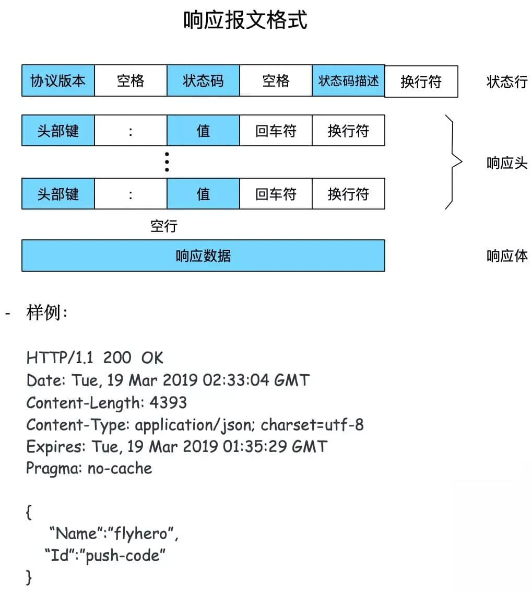
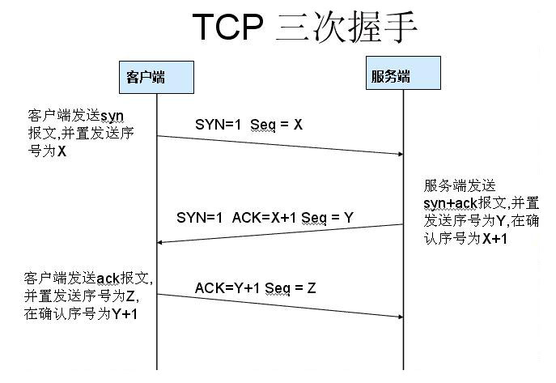

# cookie

## 生存周期

- expires：过期时间
- max-age：有效期

> max-age与expired同时设置，默认支持max-age则以max-age为准，否则以expires为准
>
> 没有设置过期相关字段，则关闭浏览器后失效

## 安全

- 带上`Secure`说明只能通过 HTTPS 传输 cookie。
- 带上`HttpOnly`，那么说明只能通过 HTTP 协议传输，不能通过 JS 访问，这也是预防 XSS 攻击的重要手段。
- 对于 CSRF 攻击的预防，也有`SameSite`属性。SameSite可以设置为三个值，`Strict`、`Lax`和`None`
  - 在`Strict`模式下，浏览器完全禁止第三方请求携带Cookie。比如请求`sanyuan.com`网站只能在`sanyuan.com`域名当中请求才能携带 Cookie，在其他网站请求都不能。
  - 在`Lax`模式，就宽松一点了，但是只能在 `get 方法提交表单`况或者`a 标签发送 get 请求`的情况下可以携带 Cookie，其他情况均不能。
  - 在`None`模式下，也就是默认模式，请求会自动携带上 Cookie。

# 跨域

发送ajax时，如果`协议+主机+端口`不同则形成了跨域，浏览器同源策略限制。

Ajax 请求发出去了，服务器也成功响应了，响应到达了客户端，只是被浏览器拦截了。

## 解决方案

### jsonp

通过script标签的src src 填上目标地址从而发出 GET 请求，实现跨域请求并拿到响应。

```js
// client
const jsonp = ({ url, params, callbackName }) => {
  const generateURL = () => {
    let dataStr = '';
    for(let key in params) {
      dataStr += `${key}=${params[key]}&`;
    }
    dataStr += `callback=${callbackName}`;
    return `${url}?${dataStr}`;
  };
  return new Promise((resolve, reject) => {
    // 初始化回调函数名称
    callbackName = callbackName || Math.random().toString.replace(',', ''); 
    // 创建 script 元素并加入到当前文档中
    let scriptEle = document.createElement('script');
    scriptEle.src = generateURL();
    document.body.appendChild(scriptEle);
    // 绑定到 window 上，为了后面调用
    window[callbackName] = (data) => {
      resolve(data);
      // script 执行完了，成为无用元素，需要清除
      document.body.removeChild(scriptEle);
    }
  });
}

jsonp({
  url: 'http://localhost:3000',
  params: { 
    a: 1,
    b: 2
  }
}).then(data => {
  // 拿到数据进行处理
  console.log(data); // 数据包
})

// server
let express = require('express')
let app = express()
app.get('/', function(req, res) {
  let { a, b, callback } = req.query
  console.log(a); // 1
  console.log(b); // 2
  // 注意哦，返回给script标签，浏览器直接把这部分字符串执行
  res.end(`${callback}('数据包')`);
})
app.listen(3000)

```


### CORS 跨域资源共享

它需要浏览器和服务器的共同支持，服务器需要附加特定的响应头。

浏览器根据请求方法和请求头的特定字段，将请求做了一下分类，具体来说规则是这样，凡是满足下面条件的属于**简单请求**:

- 请求方法为 GET、POST 或者 HEAD
- 请求头的取值范围: Accept、Accept-Language、Content-Language、Content-Type(只限于三个值`application/x-www-form-urlencoded`、`multipart/form-data`、`text/plain`)

浏览器画了这样一个圈，在这个圈里面的就是**简单请求**, 圈外面的就是**非简单请求**，然后针对这两种不同的请求进行不同的处理。

#### 简单请求

请求发出去之前，它会自动在请求头当中，添加一个`Origin`字段，用来说明请求来自哪个`源`。服务器拿到请求之后，在回应时对应地添加`Access-Control-Allow-Origin`字段，如果`Origin`不在这个字段的范围中，那么浏览器就会将响应拦截。

#### 非简单请求

分为**预检请求**和**响应字段**两个阶段。

首先发送方法为是**OPTIONS **的**预检请求**，同时会加上`Origin`源地址、`Host`目标地址、`Access-Control-Request-Method`、`Access-Control-Request-Headers`，在预检请求的响应返回后，如果请求不满足响应头的条件，则触发`XMLHttpRequest`的`onerror`方法，停止。否则继续向简单请求一样发送请求。

# http

HTTP（超文本传输协议）是一种可扩展的协议，无状态的。它是应用层的协议，通过[TCP](https://developer.mozilla.org/en-US/docs/Glossary/TCP)，或者是`TLS`加密的TCP连接来发送，理论上任何可靠的传输协议都可以使用。

>  注意，HTTP本质是无状态的，使用Cookies可以创建有状态的会话。

## http报文

### 请求（Request）

请求由以下元素组成：

- 请求行（http method，资源地址，http协议版本号）
- 请求头（http headers）
- 空行
- 请求体（发送的资源body）


### 响应

响应报文包含了下面的元素：

- 状态行（http协议版本号，状态码，状态信息）
- 响应头（http headers）
- 空行
- 响应体（获取的资源body）



> 空行很重要，用来区分开`头部`和`实体`。 
>
> 如果说在头部中间故意加一个空行会怎么样？
>
> 那么空行后的内容全部被视为实体。实体也就是`body`部分。请求报文对应`请求体`, 响应报文对应`响应体`。

## 请求方法

`http/1.1`规定了以下请求方法:

- GET: 通常用来获取资源
- HEAD: 获取资源的元信息
- POST: 提交数据，即上传数据
- PUT: 修改数据
- DELETE: 删除资源(几乎用不到)
- CONNECT: 建立连接隧道，用于代理服务器
- OPTIONS: 列出可对资源实行的请求方法，用来跨域请求
- TRACE: 追踪请求-响应的传输路径

### GET 和 POST 有什么区别？

首先最直观的是语义上的区别。

而后又有这样一些具体的差别:

- 从**缓存**的角度，GET 请求会被浏览器主动缓存下来，留下历史记录，而 POST 默认不会。
- 从**编码**的角度，GET 只能进行 URL 编码，只能接收 ASCII 字符，而 POST 没有限制。
- 从**参数**的角度，GET 一般放在 URL 中，因此不安全，POST 放在请求体中，更适合传输敏感信息。
- 从**幂等性**的角度，`GET`是**幂等**的，而`POST`不是。(`幂等`表示执行相同的操作，结果也是相同的)
- 从**TCP**的角度，GET 请求会把请求报文一次性发出去，而 POST 会分为两个 TCP 数据包，首先发 header 部分，如果服务器响应 100(continue)， 然后发 body 部分。(**火狐**浏览器除外，它的 POST 请求只发一个 TCP 包)

## http状态码

RFC 规定 HTTP 的状态码为**三位数**，被分为五类:

- **1xx**: 表示目前是协议处理的中间状态，还需要后续操作。
- **2xx**: 表示成功状态。
- **3xx**: 重定向状态，资源位置发生变动，需要重新请求。
- **4xx**: 请求报文有误。
- **5xx**: 服务器端发生错误。

### 1xx

**101 Switching Protocols**。在`HTTP`升级为`WebSocket`的时候，如果服务器同意变更，就会发送状态码 101。

### 2xx

**200 OK**是见得最多的成功状态码。通常在响应体中放有数据。

**204 No Content**含义与 200 相同，但响应头后没有 body 数据。

**206 Partial Content**顾名思义，表示部分内容，它的使用场景为 HTTP 分块下载和断点续传，当然也会带上相应的响应头字段`Content-Range`。

### 3xx

**301 Moved Permanently**即永久重定向，浏览器默认会做缓存优化，在第二次访问的时候自动访问重定向的那个地址。

**302 Found**，即临时重定向，浏览器并不会做缓存优化。

**304 Not Modified**: 当协商缓存命中时会返回这个状态码。

### 4xx

**400 Bad Request**: 开发者经常看到一头雾水，只是笼统地提示了一下错误，并不知道哪里出错了。

**403 Forbidden**: 这实际上并不是请求报文出错，而是服务器禁止访问，原因有很多，比如法律禁止、信息敏感。

**404 Not Found**: 资源未找到，表示没在服务器上找到相应的资源。

**405 Method Not Allowed**: 请求方法不被服务器端允许。

**406 Not Acceptable**: 资源无法满足客户端的条件。

**408 Request Timeout**: 服务器等待了太长时间。

**409 Conflict**: 多个请求发生了冲突。

**413 Request Entity Too Large**: 请求体的数据过大。

**414 Request-URI Too Long**: 请求行里的 URI 太大。

**429 Too Many Request**: 客户端发送的请求过多。

**431 Request Header Fields Too Large**请求头的字段内容太大。

### 5xx

**500 Internal Server Error**: 仅仅告诉你服务器出错了，出了啥错咱也不知道。

**501 Not Implemented**: 表示客户端请求的功能还不支持。

**502 Bad Gateway**: 服务器自身是正常的，但访问的时候出错了，啥错误咱也不知道。

**503 Service Unavailable**: 表示服务器当前很忙，暂时无法响应服务。

## 定长和不定长的数据传输的

### 定长包体

对于定长包体而言，发送端在传输的时候一般会带上 `Content-Length`, 来指明包体的长度。

我们用一个`nodejs`服务器来模拟一下:

```js
const http = require('http');

const server = http.createServer();

server.on('request', (req, res) => {
  if(req.url === '/') {
    res.setHeader('Content-Type', 'text/plain');
    res.setHeader('Content-Length', 10);
    res.write("helloworld");
  }
})

server.listen(8081, () => {
  console.log("成功启动");
})
```

启动后访问: **localhost:8081**。

浏览器中显示如下:

```
helloworld
```

这是长度正确的情况，那不正确的情况是如何处理的呢？

我们试着把这个长度设置的小一些:

```js
res.setHeader('Content-Length', 8);
```

重启服务，再次访问，现在浏览器中内容如下:

```
hellowor
```

那后面的`ld`哪里去了呢？实际上在 http 的响应体中直接被截去了。

然后我们试着将这个长度设置得大一些:

```js
res.setHeader('Content-Length', 12);
```

此时浏览器显示如下:

```
 无法正常运行
```

直接无法显示了。可以看到`Content-Length`对于 http 传输过程起到了十分关键的作用，如果设置不当可以直接导致传输失败。

### 不定长包体

上述是针对于`定长包体`，那么对于`不定长包体`而言是如何传输的呢？

这里就必须介绍另外一个 http 头部字段了:

```js
Transfer-Encoding: chunked
```

表示分块传输数据，设置这个字段后会自动产生两个效果:

- Content-Length 字段会被忽略
- 基于长连接持续推送动态内容

我们依然以一个实际的例子来模拟分块传输，nodejs 程序如下:

```js
const http = require('http');

const server = http.createServer();

server.on('request', (req, res) => {
  if(req.url === '/') {
    res.setHeader('Content-Type', 'text/html; charset=utf8');
    res.setHeader('Content-Length', 10);
    res.setHeader('Transfer-Encoding', 'chunked');
    res.write("<p>来啦</p>");
    setTimeout(() => {
      res.write("第一次传输<br/>");
    }, 1000);
    setTimeout(() => {
      res.write("第二次传输");
      res.end()
    }, 2000);
  }
})

server.listen(8009, () => {
  console.log("成功启动");
})
```

## 大文件的传输

对于几百 M 甚至上 G 的大文件来说，如果要一口气全部传输过来显然是不现实的，会有大量的等待时间，严重影响用户体验。因此，HTTP 针对这一场景，采取了`范围请求`的解决方案，允许客户端仅仅请求一个资源的一部分。

前提是服务器要支持**范围请求**，要支持这个功能，就必须加上这样一个响应头:

```
Accept-Ranges: none
```

用来告知客户端这边是支持范围请求的。

### Range 字段拆解

而对于客户端而言，它需要指定请求哪一部分，通过`Range`这个请求头字段确定，格式为`bytes=x-y`。接下来就来讨论一下这个 Range 的书写格式:

- **0-499**表示从开始到第 499 个字节。
- **500**- 表示从第 500 字节到文件终点。
- **-100**表示文件的最后100个字节。

服务器收到请求之后，首先验证范围**是否合法**，如果越界了那么返回`416`错误码，否则读取相应片段，返回`206`状态码。

同时，服务器需要添加`Content-Range`字段，这个字段的格式根据请求头中`Range`字段的不同而有所差异。

具体来说，请求`单段数据`和请求`多段数据`，响应头是不一样的。

举个例子:

```
// 单段数据
Range: bytes=0-9
// 多段数据
Range: bytes=0-9, 30-39

```

接下来我们就分别来讨论着两种情况。

### 单段数据

对于`单段数据`的请求，返回的响应如下:

```
HTTP/1.1 206 Partial Content
Content-Length: 10
Accept-Ranges: bytes
Content-Range: bytes 0-9/100

i am xxxxx
```

值得注意的是`Content-Range`字段，`0-9`表示请求的返回，`100`表示资源的总大小，很好理解。

### 多段数据

接下来我们看看多段请求的情况。得到的响应会是下面这个形式:

```
HTTP/1.1 206 Partial Content
Content-Type: multipart/byteranges; boundary=00000010101
Content-Length: 189
Connection: keep-alive
Accept-Ranges: bytes


--00000010101
Content-Type: text/plain
Content-Range: bytes 0-9/96

i am xxxxx
--00000010101
Content-Type: text/plain
Content-Range: bytes 20-29/96

eex jspy e
--00000010101--
```

这个时候出现了一个非常关键的字段`Content-Type: multipart/byteranges;boundary=00000010101`，它代表了信息量是这样的:

- 请求一定是多段数据请求
- 响应体中的分隔符是 00000010101

因此，在响应体中各段数据之间会由这里指定的分隔符分开，而且在最后的分隔末尾添上`--`表示结束。

以上就是 http 针对大文件传输所采用的手段。

## 表单数据的提交

在 http 中，有两种主要的表单提交的方式，体现在两种不同的`Content-Type`取值:

- application/x-www-form-urlencoded
- multipart/form-data

由于表单提交一般是`POST`请求，很少考虑`GET`，因此这里我们将默认提交的数据放在请求体中。

#### application/x-www-form-urlencoded

对于`application/x-www-form-urlencoded`格式的表单内容，有以下特点:

- 其中的数据会被编码成以`&`分隔的键值对
- 字符以**URL编码方式**编码。

如：

```
// 转换过程: {a: 1, b: 2} -> a=1&b=2 -> 如下(最终形式)
"a%3D1%26b%3D2"
复制代码
```

### multipart/form-data

经常用于文件传输等场景

对于`multipart/form-data`而言:

- 请求头中的`Content-Type`字段会包含`boundary`，且`boundary`的值有浏览器默认指定。例: `Content-Type: multipart/form-data;boundary=----WebkitFormBoundaryRRJKeWfHPGrS4LKe`。
- 数据会分为多个部分，每两个部分之间通过分隔符来分隔，每部分表述均有 HTTP 头部描述子包体，如`Content-Type`，在最后的分隔符会加上`--`表示结束。

相应的`请求体`是下面这样:

```
Content-Disposition: form-data;name="data1";
Content-Type: text/plain
data1
----WebkitFormBoundaryRRJKeWfHPGrS4LKe
Content-Disposition: form-data;name="data2";
Content-Type: text/plain
data2
----WebkitFormBoundaryRRJKeWfHPGrS4LKe--
复制代码
```

### 小结

值得一提的是，`multipart/form-data` 格式最大的特点在于:**每一个表单元素都是独立的资源表述**。另外，你可能在写业务的过程中，并没有注意到其中还有`boundary`的存在，如果你打开抓包工具，确实可以看到不同的表单元素被拆分开了，之所以在平时感觉不到，是以为浏览器和 HTTP 给你封装了这一系列操作。

而且，在实际的场景中，对于图片等文件的上传，基本采用`multipart/form-data`而不用`application/x-www-form-urlencoded`，因为没有必要做 URL 编码，带来巨大耗时的同时也占用了更多的空间。

## HTTP 缺点

### 无状态

所谓的优点和缺点还是要分场景来看的，对于 HTTP 而言，最具争议的地方在于它的**无状态**。

在需要长连接的场景中，需要保存大量的上下文信息，以免传输大量重复的信息，那么这时候无状态就是 http 的缺点了。

但与此同时，另外一些应用仅仅只是为了获取一些数据，不需要保存连接上下文信息，无状态反而减少了网络开销，成为了 http 的优点。

### 明文传输

即协议里的报文(主要指的是头部)不使用二进制数据，而是文本形式。

这当然对于调试提供了便利，但同时也让 HTTP 的报文信息暴露给了外界，给攻击者也提供了便利。`WIFI陷阱`就是利用 HTTP 明文传输的缺点，诱导你连上热点，然后疯狂抓你所有的流量，从而拿到你的敏感信息。

### 队头阻塞问题

当 http 开启长连接时，共用一个 TCP 连接，同一时刻只能处理一个请求，那么当前请求耗时过长的情况下，其它的请求只能处于阻塞状态，也就是著名的**队头阻塞**问题。

# http历史

## http0.9

HTTP 的最早版本诞生在 1991 年，这个最早版本和现在比起来极其简单，没有 HTTP 头，没有状态码，甚至版本号也没有，后来它的版本号才被定为 0.9 来和其他版本的 HTTP 区分。HTTP/0.9 只支持一种方法—— Get，请求只有一行。

```
GET /hello.html
```

响应也是非常简单的，只包含 html 文档本身。

```
<HTML>
Hello world
</HTML>
```

当 TCP 建立连接之后，服务器向客户端返回 HTML 格式的字符串。发送完毕后，就关闭 TCP 连接。由于没有状态码和错误代码，如果服务器处理的时候发生错误，只会传回一个特殊的包含问题描述信息的 HTML 文件。这就是最早的 HTTP/0.9 版本。

## http1.0

相比 HTTP/0.9，HTTP/1.0 主要有如下特性：

- 请求与响应支持 HTTP 头，增加了状态码，响应对象的一开始是一个响应状态行
- 协议版本信息需要随着请求一起发送，支持 HEAD，POST 方法
- 支持传输 HTML 文件以外其他类型的内容

一个典型的 HTTP/1.0 的请求像这样：

```php
GET /hello.html HTTP/1.0
User-Agent:NCSA_Mosaic/2.0(Windows3.1)

200 OK
Date: Tue, 15 Nov 1996 08:12:31 GMT
Server: CERN/3.0 libwww/2.17
Content-Type: text/html

<html>
一个包含图片的页面
<IMGSRC="/smile.gif">
</html>
```

## http1.1

HTTP/1.1 更多的是作为对 HTTP/1.0 的完善，在 HTTP1.1 中，主要具有如下改进：

- **HTTP 1.1支持长连接（PersistentConnection）**

- **请求的流水线（Pipelining）处理**

- **HTTP 1.1增加host字段**

- **错误通知的管理**

- **带宽优化及网络连接的使用**

- **缓存处理**

- 新增了 OPTIONS,PUT, DELETE, TRACE, CONNECT 方法

## HTTP1.1 如何解决 HTTP 的队头阻塞问题？

### 并发连接

对于一个域名允许分配多个长连接，那么相当于增加了任务队列，不至于一个队伍的任务阻塞其它所有任务。在RFC2616规定过客户端最多并发 2 个连接，不过事实上在现在的浏览器标准中，这个上限要多很多，Chrome 中是 6 个。

但其实，即使是提高了并发连接，还是不能满足人们对性能的需求。

### 域名分片

一个域名不是可以并发 6 个长连接吗？那我就多分几个域名。

比如 content1.sanyuan.com 、content2.sanyuan.com。

这样一个`sanyuan.com`域名下可以分出非常多的二级域名，而它们都指向同样的一台服务器，能够并发的长连接数更多了，事实上也更好地解决了队头阻塞的问题。

# http2

## HTTP1.0和1.1现存的一些问题

1. 上面提到过的，HTTP1.x在传输数据时，每次都需要重新建立连接，无疑增加了大量的延迟时间，特别是在移动端更为突出。
2.  HTTP1.x在传输数据时，所有传输的内容都是明文，客户端和服务器端都无法验证对方的身份，这在一定程度上无法保证数据的安全性。
3.  HTTP1.x在使用时，header里携带的内容过大，在一定程度上增加了传输的成本，并且每次请求header基本不怎么变化，尤其在移动端增加用户流量。
4.  虽然HTTP1.x支持了keep-alive，来弥补多次创建连接产生的延迟，但是keep-alive使用多了同样会给服务端带来大量的性能压力，并且对于单个文件被不断请求的服务(例如图片存放网站)，keep-alive可能会极大的影响性能，因为它在文件被请求之后还保持了不必要的连接很长时间。

## http2特性

- **http2是一个二进制协议。**

- **二进制格式**

- **多路复用**

- **优先级和依赖性**

- **http头压缩**

- **重置，取消发送**

- **服务器推送**

- **流量控制**

  

# https

## 加密算法

### 对称加密(AES)

发送方和接收方需要持有同一把密钥，发送消息和接收消息均使用该密钥。相对于非对称加密，对称加密具有更高的加解密速度，但双方都需要事先知道密钥，密钥在传输过程中可能会被窃取，因此安全性没有非对称加密高。

### 非对称加密(RSA)

接收方在发送消息前需要事先生成公钥和私钥，然后将公钥发送给发送方。发送放收到公钥后，将待发送数据用公钥加密，发送给接收方。接收到收到数据后，用私钥解密。

在这个过程中，公钥负责加密，私钥负责解密，数据在传输过程中即使被截获，攻击者由于没有私钥，因此也无法破解。

非对称加密算法的加解密速度低于对称加密算法，但是安全性更高。

## https 原理

简单说就是通过非对称加密算法告诉对方后续对称加密算法的秘钥，然后使用对称加密算法对消息进行加密。

HTTPS在传输数据之前需要客户端（浏览器）与服务端（网站）之间进行一次握手，在握手过程中将确立双方加密传输数据的密码信息。TLS/SSL中使用了非对称加密，对称加密以及HASH算法。握手过程的简单描述如下：

1. 客户端请求 HTTPS 网址

2. 服务器响应客户端请求，将证书传递给客户端，证书包含公钥和大量其他信息。

3. 客户端解析证书并对其进行验证。如果证书不通过则显示警告信息，否则继续。。

4. 客户端就会从服务器证书中取出服务器的公钥A。然后客户端生成一个随机码 KEY，并使用公钥A将其加密，发送给服务器，作为后面对称加密的密钥。
	
5. 服务器使用自己的私钥解密这个消息，得到对称密钥，至此，Client和Server双方都持有了相同的对称密钥。
6. 双方使用对称加密愉快地传输所有数据。

参考链接：https://mp.weixin.qq.com/s/StqqafHePlBkWAPQZg3NrA


### Http与Https的区别：

> Http与Https的区别：

1. HTTP 的URL 以http:// 开头，而HTTPS 的URL 以https:// 开头
2. HTTP无需证书，而HTTPS 需要CA机构颁发的SSL证书
3. HTTP和HTTPS使用的是完全不同的连接方式，用的端口也不一样，前者是80，后者是443。
4. HTTP协议运行在TCP之上，所有传输的内容都是明文，HTTPS运行在SSL/TLS之上，SSL/TLS运行在TCP之上，所有传输的内容都经过加密的。
5. HTTPS可以有效的防止运营商劫持

# URI

**URI**, 全称为(Uniform Resource Identifier), 也就是**统一资源标识符**，它的作用很简单，就是区分互联网上不同的资源。

但是，它并不是我们常说的`网址`, 网址指的是`URL`, 实际上`URI`包含了`URN`和`URL`两个部分，由于 URL 过于普及，就默认将 URI 视为 URL 了。


## URI 编码

URI 只能使用`ASCII`, ASCII 之外的字符是不支持显示的，而且还有一部分符号是界定符，如果不加以处理就会导致解析出错。

因此，URI 引入了`编码`机制，将所有**非 ASCII 码字符**和**界定符**转为十六进制字节值，然后在前面加个`%`。

如，空格被转义成了`%20`，**三元**被转义成了`%E4%B8%89%E5%85%83`。


# TCP

## 三次握手



> **TCP标示**:
>
> 1. SYN(synchronous 同步)同步标志位
> 2. ACK(acknowledgement 确认)
> 3. Seq(sequence number顺序号码)

### 第一次握手

client 发送一个 **SYN(X)包** 给 server，然后等待 server 的 ACK 回复，进入 `SYN-SENT` 状态。

### 第二次握手

server 接收到 SYN(seq=x) 包后就返回一个 **ACK(X+1)确认包** 以及一个自己的 **SYN(Y)** 包，然后等待 client 的 ACK 回复，server 进入 `SYN-RECIVED` 状态。

### 第三次握手

client 接收到 server 发回的 ACK(X+1) 包后，进入 `ESTABLISHED` 状态。然后根据 server 发来的 SYN(Y) 包，返回给等待中的 server 一个 **ACK(Y+1)包**。等待中的 server 收到 ACK 回复，也把自己的状态设置为 `ESTABLISHED`。到此 TCP 三次握手完成，client 与 server 可以正常进行通信了。

**简化逻辑就是:**

**1.A 发送SYN报文给B**

**2. B发送ACK确认A的SYN报文，同时发送自己的SYN报文给A**

**3. A发送ACK确认B的SYN报文，这是第四次报文交互**

> ### 补充：A: client B: server
>
> **第一个包，即A发给B的SYN 中途被丢，没有到达B**
>
> A会周期性超时重传，直到收到B的确认
>
> **第二个包，即B发给A的SYN +ACK 中途被丢，没有到达A**
>
> B会周期性超时重传，直到收到A的确认
>
> **第三个包，即A发给B的ACK 中途被丢，没有到达B**
>
> A发完ACK，单方面认为TCP为 Established(成立)状态，
>
> 而B显然认为TCP为Active状态：
>
> ​	1. 假定此时双方都没有数据发送，B会周期性超时重传，直到收到A的确认，收到之后B的TCP 连接也为 Established状态，双向可以发包。
>
> ​	2. 假定此时A有数据发送，B收到A的 Data + ACK，自然会切换为established 状态，并接受A的 Data。
>
> ​	3. 假定B有数据发送，数据发送不了，会一直周期性超时重传SYN + ACK，直到收到A的确认才可以发送数据。

##### 为什么要三次握手？

为了防止已失效的连接请求报文段重新突然发送到服务端，导致建立不必要的连接，所以一次握手和两次握手均是不可行的，为了解决这种情况要么使用三次握手，要么就只能消耗更多的资源来进行额外的判断。第一次握手消息，服务端确认了客户端可以**正常发送消息**，第二次握手消息客户端确认了服务端可以**正常接收消息**也可以**正常发送消息**，第三次握手消息服务端确认了客户端可以**正常接收消息**。经过至少三次握手之后，连接的一方才能够对另一方接收和发送消息的能力有一个准确的判断。

具体例子：“已失效的连接请求报文段”的产生在这样一种情况下：client发出的第一个连接请求报文段并没有丢失，而是在某个网络结点长时间的滞留了，以致延误到连接释放以后的某个时间才到达server。本来这是一个早已失效的报文段。但server收到此失效的连接请求报文段后，就误认为是client再次发出的一个新的连接请求。于是就向client发出确认报文段，同意建立连接。假设不采用“三次握手”，那么只要server发出确认，新的连接就建立了。由于现在client并没有发出建立连接的请求，因此不会理睬server的确认，也不会向server发送数据。但server却以为新的运输连接已经建立，并一直等待client发来数据。这样，server的很多资源就白白浪费掉了。采用“三次握手”的办法可以防止上述现象发生。例如刚才那种情况，client不会向server的确认发出确认。server由于收不到确认，就知道client并没有要求建立连接。”


## 四次挥手

当客户端和服务器通过三次握手建立了TCP连接以后，当数据传送完毕，肯定是要断开TCP连接的啊。那对于TCP的断开连接，这里就有了神秘的“四次分手”。


### 1. 第一次分手

客户端设置 Seq（Sequence Number）、ACK 向服务端发送一个 FIN=1 报文段，此时客户端进入 FIN_WAIT 状态，表示客户端没有数据发送给服务端了。

### 2. 第二次分手

服务端收到客户端的 FIN=1 报文段之后，回复 ACK 给到客户端，意为同意你的关闭请求。

### 3. 第三次分手

服务端向客户端发送 FIN 报文段，请求关闭连接，进入 LAST_ACK 状态。

### 4. 第四次分手

客户端收到服务端的 FIN 报文段之后，同时向服务端做最后 ACK 确认，且不会立即关闭链接，而是进入 TIME_WAIT 状态，等待 2MSL 时间片段，若 MSL 时间片段内收到服务端的回复，进行重传，若没有收到服务端的回复，则表示服务端已关闭，客户端也进行关闭。

### 为什么要四次分手？

TCP协议是一种面向连接的、可靠的、基于字节流的运输层通信协议。TCP是全双工模式，这就意味着，当主机1发出FIN报文段时，只是表示主机1已经没有数据要发送了，主机1告诉主机2，它的数据已经全部发送完毕了；但是，这个时候主机1还是可以接受来自主机2的数据；当主机2返回ACK报文段时，表示它已经知道主机1没有数据发送了，但是主机2还是可以发送数据到主机1的；当主机2也发送了FIN报文段时，这个时候就表示主机2也没有数据要发送了，就会告诉主机1，我也没有数据要发送了，之后彼此就会愉快的中断这次TCP连接。

### 为什么要等待2MSL？

MSL：报文段最大生存时间，它是任何报文段被丢弃前在网络内的最长时间。
原因有二：

- 保证TCP协议的全双工连接能够可靠关闭
- 保证这次连接的重复数据段从网络中消失

第一点：如果主机1直接CLOSED了，那么由于IP协议的不可靠性或者是其它网络原因，导致主机2没有收到主机1最后回复的ACK。那么主机2就会在超时之后继续发送FIN，此时由于主机1已经CLOSED了，就找不到与重发的FIN对应的连接。所以，主机1不是直接进入CLOSED，而是要保持TIME_WAIT，当再次收到FIN的时候，能够保证对方收到ACK，最后正确的关闭连接。

第二点：如果主机1直接CLOSED，然后又再向主机2发起一个新连接，我们不能保证这个新连接与刚关闭的连接的端口号是不同的。也就是说有可能新连接和老连接的端口号是相同的。一般来说不会发生什么问题，但是还是有特殊情况出现：假设新连接和已经关闭的老连接端口号是一样的，如果前一次连接的某些数据仍然滞留在网络中，这些延迟数据在建立新连接之后才到达主机2，由于新连接和老连接的端口号是一样的，TCP协议就认为那个延迟的数据是属于新连接的，这样就和真正的新连接的数据包发生混淆了。所以TCP连接还要在TIME_WAIT状态等待2倍MSL，这样可以保证本次连接的所有数据都从网络中消失。

# DNS解析过程

*DNS*（Domain Name Server，域名服务器）是进行域名(domain name)和与之相对应的IP地址(IP address)转换的服务器。

1. 浏览器DNS缓存
2. 操作系统DNS缓存
3. 路由器缓存
4. ISP DNS缓存（ISP 为互联网服务提供商，即运营商的DNS缓存服务器）

# http, https/2, https, TCP

### 问题：简单讲解一下 http2 的多路复用

HTTP2采用二进制格式传输，取代了HTTP1.x的文本格式，二进制格式解析更高效。
多路复用代替了HTTP1.x的序列和阻塞机制，所有的相同域名请求都通过同一个TCP连接并发完成。在HTTP1.x中，并发多个请求需要多个TCP连接，浏览器为了控制资源会有6-8个TCP连接都限制。
HTTP2中

- 同域名下所有通信都在单个连接上完成，消除了因多个 TCP 连接而带来的延时和内存消耗。
- 单个连接上可以并行交错的请求和响应，之间互不干扰


参考：

[HTTP灵魂之问，巩固你的 HTTP 知识体系](https://juejin.im/post/5e76bd516fb9a07cce750746#heading-74)

http://47.98.159.95/my_blog/